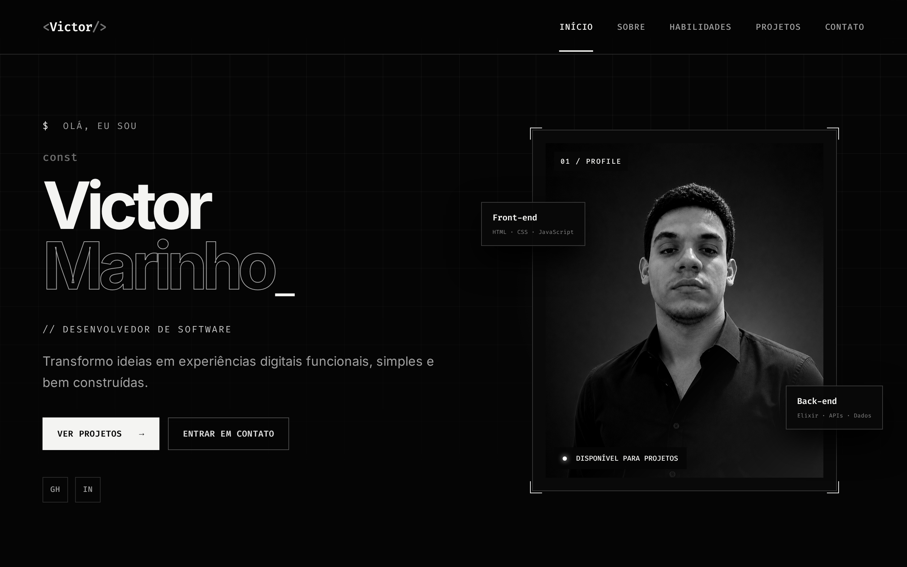

# Portfólio Básico — HTML/CSS + React

<p align="center">
  
  
  
  
  
</p>

<p align="center">
  Repositório com duas versões do mesmo portfólio — <strong>HTML/CSS/JS puro</strong> e <strong>React + Vite + TypeScript</strong> —<br/>
  criado por <strong>Victor Marinho</strong> para apresentar habilidades, projetos e contato de forma minimalista e responsiva.
</p>

---

## ✨ Preview (versão React)



<p align="center">
  <a href="./portfolio-react/screenshots/screenshot-desktop.png">Ver página completa</a> •
  <a href="./portfolio-react/screenshots/screenshot-mobile.png">Ver mobile</a>
</p>

---

## 📁 O que tem aqui

```
.
├── portfolio_html/        # versão original — HTML + CSS + JS + Bootstrap
│   ├── index.html
│   ├── style.css
│   ├── script.js
│   └── assets/foto.png
│
├── portfolio-react/       # versão moderna — React + Vite + TypeScript
│   ├── src/App.tsx        # todas as seções (hero, sobre, habilidades, projetos, contato)
│   ├── src/styles.css     # design system dark
│   ├── public/assets/     # assets copiados do projeto HTML
│   └── screenshots/       # prints usados nos READMEs
│
└── screenshots/           # cópia dos prints na raiz (para o README raiz)
    ├── screenshot-hero.png
    ├── screenshot-desktop.png
    └── screenshot-mobile.png
```

## 🔄 Evolução

| Versão | Stack | Destaques |
|---|---|---|
| **portfolio_html** | HTML, CSS, JS, Bootstrap 5.3 | Estrutura simples, 3 seções (sobre/projetos/contato), hero com foto |
| **portfolio-react** | React 18, Vite 5, TS 5 | Header fixo com navegação ativa, reveal animado, menu mobile, cards com chips, design dark com grid + blur |

A versão React reaproveita o conteúdo original, mas refina o visual: paleta `black #050505 / white #f4f4f2`, tipografia `Fira Code + Inter`, e animações com `IntersectionObserver`.

## 🚀 Como rodar

### React (recomendado)

```bash
cd portfolio-react
npm install
npm run copy:assets   # copia assets do projeto HTML
npm run dev           # http://localhost:5173
```

Outros comandos:

```bash
npm run build         # gera dist/
npm run preview       # serve dist/ em http://localhost:4173
```

### HTML puro

Abra direto no navegador — sem build:

```bash
# opção 1: abrir arquivo
open portfolio_html/index.html

# opção 2: servir com Vite/Python
npx serve portfolio_html
# ou
python3 -m http.server --directory portfolio_html 8000
```

## 🧩 Projetos em destaque

- **Lâmpada Inteligente** · `ESP32 · Mobile · IoT` — iluminação com controle por app
- **ChessDuel** · `Elixir · Vue.js · WebSocket` — xadrez online *(em desenvolvimento)*
- **Monitoramento Ambiental** · `ESP32 · Sensores · Dados` — sensores para ambientes controlados

## 🛠️ Tecnologias

- **Front-end:** HTML, CSS, JavaScript, React, Vue.js, Next.js, Angular
- **Back-end:** Elixir, Ruby, PHP, SQL, APIs
- **Sistemas & IoT:** Linux, Git, ESP32, Sensores

## 📸 Screenshots

| Desktop — Full | Mobile |
|---|---|
|  |  |

> Gerados com Playwright a partir do `vite preview` (`1280×800` @2x e `390×844`).

## 👤 Autor

**Victor Marinho**

- GitHub: [@Marinho2005](https://github.com/Marinho2005)
- LinkedIn: [victor-marinho-8271962b9](https://www.linkedin.com/in/victor-marinho-8271962b9/)
- E-mail: [vimarinholima@gmail.com](mailto:vimarinholima@gmail.com)

---

<p align="center">
  <sub>© 2026 Victor Marinho — <a href="./portfolio-react/">Ver versão React</a> • <a href="./portfolio_html/">Ver versão HTML</a></sub>
</p>
